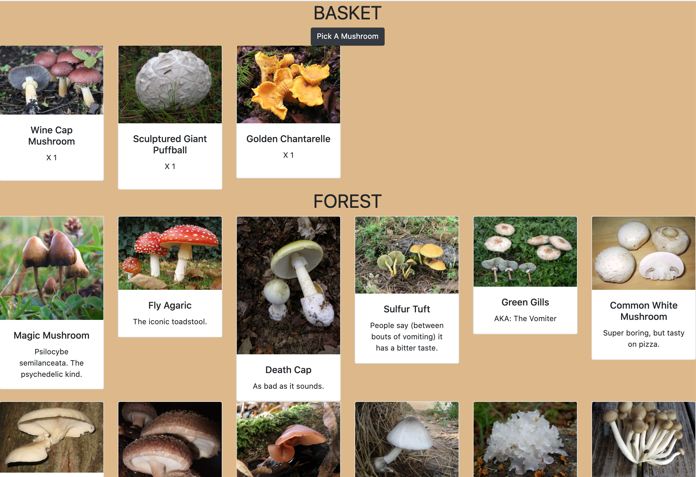

# NSS Exercise: "Mushroom Picker”

### Technologies Used:
SCSS/CSS, React Javascript, Webpack

### Description:
NSS homework project, which introduces React State and Props

“Design single-page web app (game) that enables the user to pick mushrooms from the forest.”

#### Exercise Requirements
- separate React components for Forest, Basket, and Mushroom
- seed data of 20 mushroom objects
- 3 Special mushrooms that are Poison, Deadly, or Magic
- When user picks a Poison mushroom, two other mushrooms in the basket die (are removed)
- When user picks a Deadly mushroom, ALL other mushrooms in the basket die (are removed)
- When user picks a Magic mushroom, one of each Normal mushroom is added to the basket
- The user WINS the game when at least one of each mushroom is collected in the basket (either by multiple picking, or finding a Magic mushroom)
- Events for each Special mushroom, to tell the user what happened/ when they win

#### Bonus Challenges Completed
- [x] Only display one mushroom card per type, but display # of multiples with a quantity

### Screenshot:
#### Main View of Basket with some Mushrooms, and the Forest

### Instructions to Run:
Run Locally:
1. If you do not have npm http-server installed, follow instuctions [here](https://www.npmjs.com/package/http-server) to install on your device
1. Use GitHub's [Cloning Feature](https://help.github.com/en/github/creating-cloning-and-archiving-repositories/cloning-a-repository) to download a local copy of the files for this project
1. In your command line interface, change directory into the folder that contains your copied files
1. Enter command: `npm install` and wait for completion
1. Enter command: `npm start`
1. The project will automatically render in your browser at url: `http://localhost:8080`
